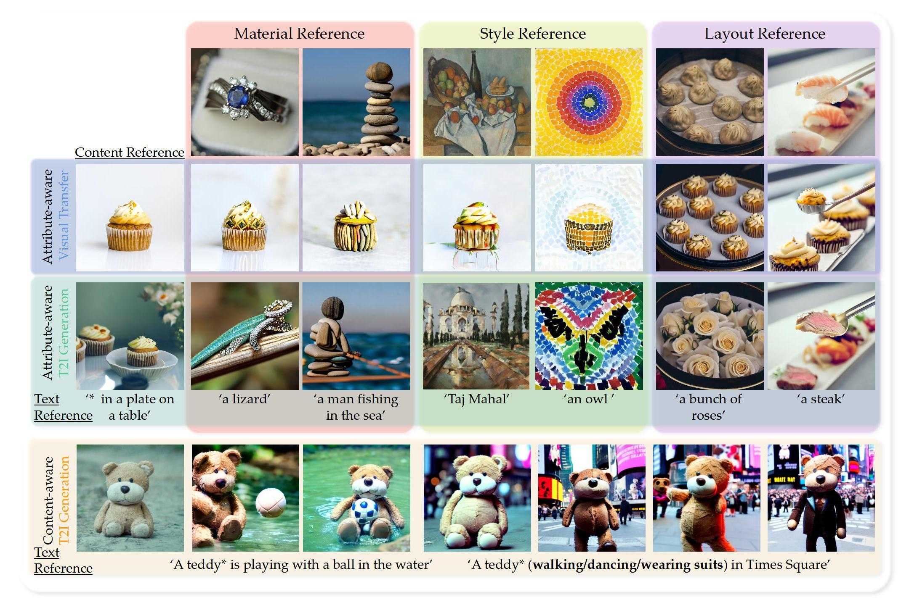
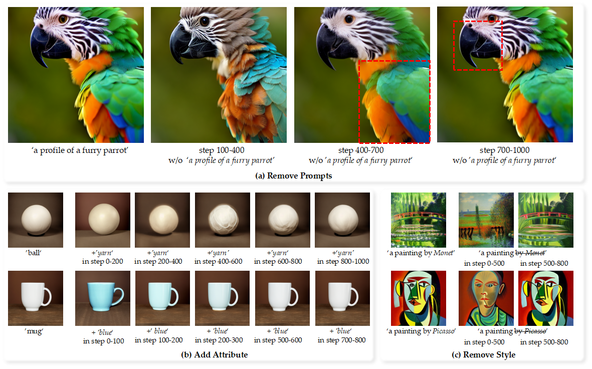
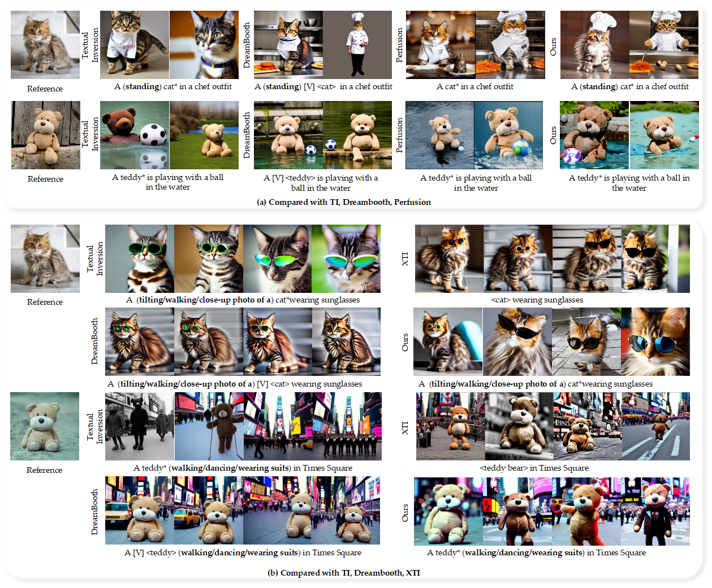
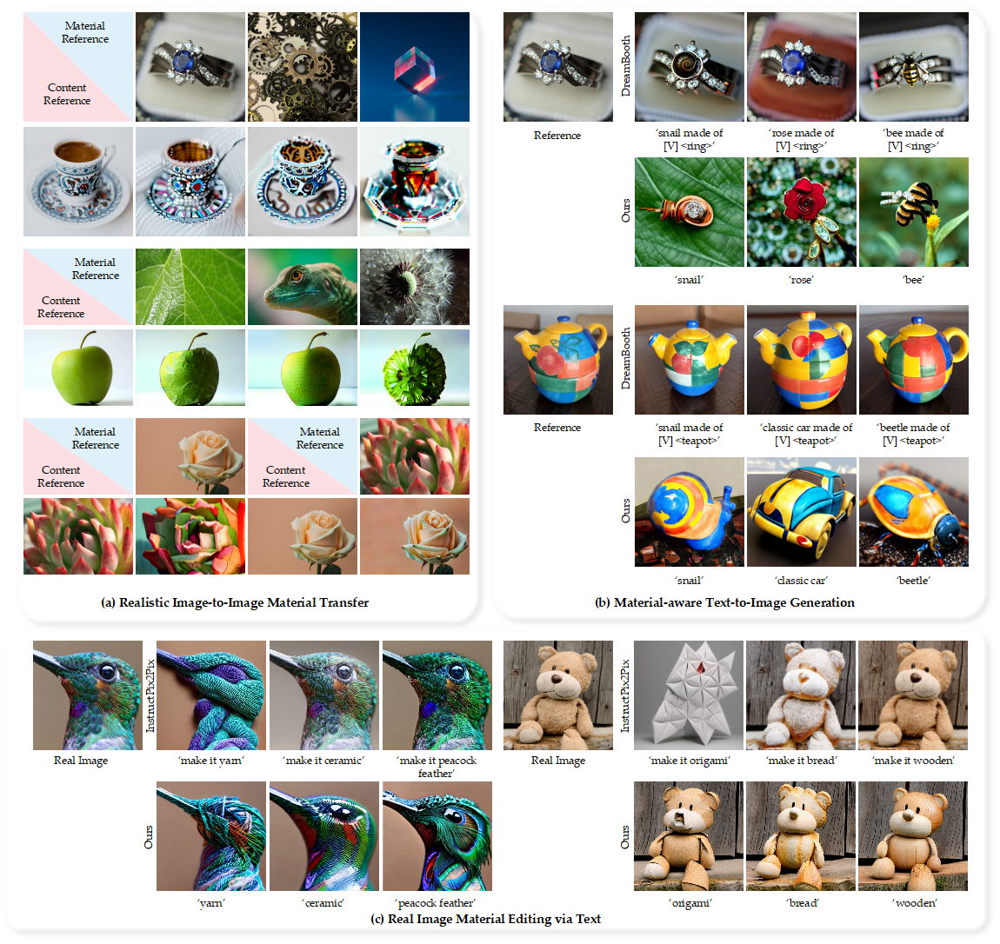
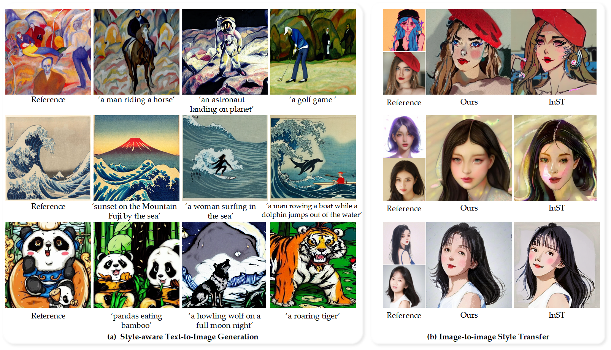
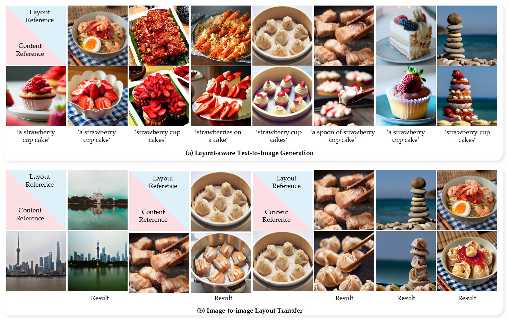
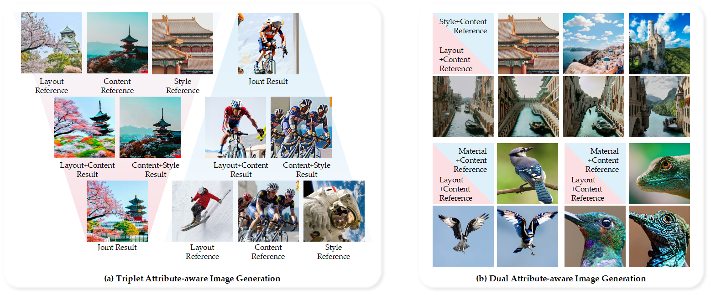

<div id="top"></div>
<!--
*** Thanks for checking out the Best-README-Template. If you have a suggestion
*** that would make this better, please fork the repo and create a pull request
*** or simply open an issue with the tag "enhancement".
*** Don't forget to give the project a star!
*** Thanks again! Now go create something AMAZING! :D
-->


<!-- PROJECT SHIELDS -->
<!--
*** I'm using markdown "reference style" links for readability.
*** Reference links are enclosed in brackets [ ] instead of parentheses ( ).
*** See the bottom of this document for the declaration of the reference variables
*** for contributors-url, forks-url, etc. This is an optional, concise syntax you may use.
*** https://www.markdownguide.org/basic-syntax/#reference-style-links
-->
<!-- [![Contributors][contributors-shield]][contributors-url]
[![Forks][forks-shield]][forks-url]
[![Stargazers][stars-shield]][stars-url]
[![Issues][issues-shield]][issues-url]
[![MIT License][license-shield]][license-url]
[![LinkedIn][linkedin-shield]][linkedin-url] -->


<!-- PROJECT LOGO -->
<br />
<!-- <div align="center">
  <a href="https://github.com/othneildrew/Best-README-Template">
    
  </a>

  <h3 align="center">Best-README-Template</h3>

  <p align="center">
    An awesome README template to jumpstart your projects!
    <br />
    <a href="https://github.com/othneildrew/Best-README-Template"><strong>Explore the docs »</strong></a>
    <br />
    <br />
    <a href="https://github.com/othneildrew/Best-README-Template">View Demo</a>
    ·
    <a href="https://github.com/othneildrew/Best-README-Template/issues">Report Bug</a>
    ·
    <a href="https://github.com/othneildrew/Best-README-Template/issues">Request Feature</a>
  </p>
</div> -->


<!-- TABLE OF CONTENTS -->
<!-- <details>
  <summary>Table of Contents</summary>
  <ol>
    <li>
      <a href="#about-the-project">CAST</a>
      <ul>
        <li><a href="#built-with">Built With</a></li>
      </ul>
    </li>
    <li>
      <a href="#getting-started">Getting Started</a>
      <ul>
        <li><a href="#prerequisites">Prerequisites</a></li>
        <li><a href="#installation">Installation</a></li>
      </ul>
    </li>
    <li><a href="#usage">Usage</a></li>
    <li><a href="#roadmap">Roadmap</a></li>
    <li><a href="#contributing">Contributing</a></li>
    <li><a href="#license">License</a></li>
    <li><a href="#contact">Contact</a></li>
    <li><a href="#acknowledgments">Acknowledgments</a></li>
  </ol>
</details> -->


<!-- ABOUT THE PROJECT -->
# ProSpect: Expanded Conditioning for the Personalization of Attribute-aware Image Generation

<!--  -->


Personalizing generative models offers a way to guide image generation with user-provided references. Current personalization methods can invert an object or concept into the textual conditioning space and compose new natural sentences for text-to-image diffusion models. However, representing and editing specific visual attributes like material, style, layout, etc. remains a challenge, leading to a lack of disentanglement and editability. To address this, we propose a novel approach that leverages the step-by-step generation process of diffusion models, which generate images from low- to high-frequency information, providing a new perspective on representing, generating, and editing images. We develop Prompt Spectrum Space P*, an expanded textual conditioning space, and a new image representation method called ProSpect. ProSpect represents an image as a collection of inverted textual token embeddings encoded from per-stage prompts, where each prompt corresponds to a specific generation stage (i.e., a group of consecutive steps) of the diffusion model. Experimental results demonstrate that P* and ProSpect offer stronger disentanglement and controllability compared to existing methods. We apply ProSpect in various personalized attribute-aware image generation applications, such as image/text-guided material/style/layout transfer/editing, achieving previously unattainable results with a single image input without fine-tuning the diffusion models.

For details see the [paper](https://arxiv.org/abs/2305.16225) 

<p align="right">(<a href="#top">back to top</a>)</p>


<!-- ### Built With -->
<!-- 
This section should list any major frameworks/libraries used to bootstrap your project. Leave any add-ons/plugins for the acknowledgements section. Here are a few examples.

* [Next.js](https://nextjs.org/)
* [React.js](https://reactjs.org/)
* [Vue.js](https://vuejs.org/)
* [Angular](https://angular.io/)
* [Svelte](https://svelte.dev/)
* [Laravel](https://laravel.com)
* [Bootstrap](https://getbootstrap.com)
* [JQuery](https://jquery.com)

<p align="right">(<a href="#top">back to top</a>)</p>
 -->


<!-- GETTING STARTED -->
## Getting Started
Coming soon ...

### Prerequisites

For packages, see environment.yaml.

  ```sh
  conda env create -f environment.yaml
  conda activate ldm
  ```

<p align="right">(<a href="#top">back to top</a>)</p>

### Installation

   Clone the repo
   ```sh
   git clone https://github.com/zyxElsa/ProSpect.git
   ```

<p align="right">(<a href="#top">back to top</a>)</p>

### Train

   Train ProSpect:
   ```sh
   python main.py --base configs/stable-diffusion/v1-finetune.yaml
               -t 
               --actual_resume ./models/sd/sd-v1-4.ckpt
               -n <run_name> 
               --gpus 0, 
               --data_root /path/to/directory/with/images
   ```
   
   See `configs/stable-diffusion/v1-finetune.yaml` for more options
   
   Download the pretrained [Stable Diffusion Model](https://huggingface.co/CompVis/stable-diffusion-v-1-4-original/resolve/main/sd-v1-4.ckpt) and save it at ./models/sd/sd-v1-4.ckpt.
   
<p align="right">(<a href="#top">back to top</a>)</p>

### Test

   To generate new images, run ProSpect.ipynb
   
   ## Instructions
   
   `prompt`: text promt that injected into all stages. 
   A '*' in the `prompt` will be replaced by `prospect_words`, if the `prospect_words` is not None.
   Otherwise, '*' will be replaced by the learned token embedding.
   
   Edit `prospect_words` to change the prompts injected into different stages. 
   A '*' in the `prospect_words` will be replaced by the learned token embedding.

   For img2img, a `content_dir` to the image is needed.
   
   ```sh
   main(prompt = '*', \
     # content_dir = './dataset/teddy.jpg', \ # For img2img, a path to the image is needed
     ddim_steps = 50, \
     strength = 0.4, \
     seed=41, \
     height = 512, \
     width = 768, \
     prospect_words = ['a teddy * walking in times sqare',  # 10 generation ends\ 
                          'a teddy * walking in times sqare',  # 9 \
                          'a teddy * walking in times sqare',  # 8 \
                          'a teddy * walking in times sqare',  # 7 \ 
                          'a teddy * walking in times sqare',  # 6 \ 
                          'a teddy * walking in times sqare',  # 5 \
                          'a teddy * walking in times sqare',  # 4 \
                          'a teddy * walking in times sqare',  # 3 \
                          'a teddy walking in times sqare',  # 2 \
                          'a teddy walking in times sqare',  # 1 generation starts\ 
                         ], \
     model = model,\
     )
   ```
   
<p align="right">(<a href="#top">back to top</a>)</p>

 
 
### Prompt Spectrum Space


Differences between (a) standard textual conditioning P and (c) the proposed prompt spectrum conditioning P*. Instead of learning global textual conditioning for the whole diffusion process, _ProSpect_ obtains a set of different token embeddings delivered from different denoising stages.
Textual Inversion loses most of the fidelity.
Compared with DreamBooth that generates cat-like objects in the images, _ProSpect_ can separate content and material, and is more fit for attribute-aware T2I image generation.

### Motivation



Experimental results showing that different attributes exist at different steps.
(a) Results of removing prompts 'a profile of a furry parrot' of different steps.
(b) Results of adding material attribute 'yarn' and color attribute 'blue'.
(c) Results of removing style attribute 'Monet' and

### Attribute-aware Image Generation with _ProSpect_

## Content-aware Image Generation


Comparisons with state-of-the-art personalization methods including Textual Inversion (TI), DreamBooth, XTI, and Perfusion.
The **bold** words correspond to the additional concepts added to each image, (e.g. the 3rd column in (a) shows the result of 'A standing cat in a chef outfit', the 6th column in (b) shows the result of 'A tilting cat wearing sunglasses').
The resulting images of XTI and Perfusion are borrowed from their paper, so the results of adding concepts are not shown.
Our method is faithful to convey the appearance and material of the reference image while having better controllability and diversity.


## Material-aware Image Generation



## Style-aware Image Generation



## Layout-aware Image Generation



## Multiple Attribute-Aware Image Generation



<!--
### Citation
   
   ```sh

   ```
   
<p align="right">(<a href="#top">back to top</a>)</p>
-->


<!-- 
<!-- USAGE EXAMPLES -->
<!-- ## Usage

Use this space to show useful examples of how a project can be used. Additional screenshots, code examples and demos work well in this space. You may also link to more resources.

_For more examples, please refer to the [Documentation](https://example.com)_

<p align="right">(<a href="#top">back to top</a>)</p> -->


<!-- ROADMAP -->
<!-- ## Roadmap

- [x] Add Changelog
- [x] Add back to top links
- [ ] Add Additional Templates w/ Examples
- [ ] Add "components" document to easily copy & paste sections of the readme
- [ ] Multi-language Support
    - [ ] Chinese
    - [ ] Spanish

See the [open issues](https://github.com/othneildrew/Best-README-Template/issues) for a full list of proposed features (and known issues).

<p align="right">(<a href="#top">back to top</a>)</p> -->


<!-- CONTRIBUTING -->
<!-- ## Contributing -->

<!-- Contributions are what make the open source community such an amazing place to learn, inspire, and create. Any contributions you make are **greatly appreciated**.

If you have a suggestion that would make this better, please fork the repo and create a pull request. You can also simply open an issue with the tag "enhancement".
Don't forget to give the project a star! Thanks again!

1. Fork the Project
2. Create your Feature Branch (`git checkout -b feature/AmazingFeature`)
3. Commit your Changes (`git commit -m 'Add some AmazingFeature'`)
4. Push to the Branch (`git push origin feature/AmazingFeature`)
5. Open a Pull Request
 -->
<!-- <p align="right">(<a href="#top">back to top</a>)</p> -->


<!-- LICENSE -->
<!-- ## License -->
<!-- 
Distributed under the MIT License. See `LICENSE.txt` for more information.
 -->
<!-- <p align="right">(<a href="#top">back to top</a>)</p> -->


<!-- CONTACT -->
## Contact

Please feel free to open an issue or contact us personally if you have questions, need help, or need explanations. Write to one of the following email addresses, and maybe put one other in the cc:

zhangyuxin2020@ia.ac.cn


<!-- 
Your Name - [@your_twitter](https://twitter.com/your_username) - email@example.com

Project Link: [https://github.com/your_username/repo_name](https://github.com/your_username/repo_name)
 -->
<p align="right">(<a href="#top">back to top</a>)</p>


<!-- ACKNOWLEDGMENTS -->
<!-- ## Acknowledgments -->
<!-- 
Use this space to list resources you find helpful and would like to give credit to. I've included a few of my favorites to kick things off!

* [Choose an Open Source License](https://choosealicense.com)
* [GitHub Emoji Cheat Sheet](https://www.webpagefx.com/tools/emoji-cheat-sheet)
* [Malven's Flexbox Cheatsheet](https://flexbox.malven.co/)
* [Malven's Grid Cheatsheet](https://grid.malven.co/)
* [Img Shields](https://shields.io)
* [GitHub Pages](https://pages.github.com)
* [Font Awesome](https://fontawesome.com)
* [React Icons](https://react-icons.github.io/react-icons/search) -->

<!-- <p align="right">(<a href="#top">back to top</a>)</p> -->


<!-- MARKDOWN LINKS & IMAGES -->
<!-- https://www.markdownguide.org/basic-syntax/#reference-style-links -->
[contributors-shield]: https://img.shields.io/github/contributors/othneildrew/Best-README-Template.svg?style=for-the-badge
[contributors-url]: https://github.com/othneildrew/Best-README-Template/graphs/contributors
[forks-shield]: https://img.shields.io/github/forks/othneildrew/Best-README-Template.svg?style=for-the-badge
[forks-url]: https://github.com/othneildrew/Best-README-Template/network/members
[stars-shield]: https://img.shields.io/github/stars/othneildrew/Best-README-Template.svg?style=for-the-badge
[stars-url]: https://github.com/othneildrew/Best-README-Template/stargazers
[issues-shield]: https://img.shields.io/github/issues/othneildrew/Best-README-Template.svg?style=for-the-badge
[issues-url]: https://github.com/othneildrew/Best-README-Template/issues
[license-shield]: https://img.shields.io/github/license/othneildrew/Best-README-Template.svg?style=for-the-badge
[license-url]: https://github.com/othneildrew/Best-README-Template/blob/master/LICENSE.txt
[linkedin-shield]: https://img.shields.io/badge/-LinkedIn-black.svg?style=for-the-badge&logo=linkedin&colorB=555
[linkedin-url]: https://linkedin.com/in/othneildrew
[product-screenshot]: images/screenshot.png
